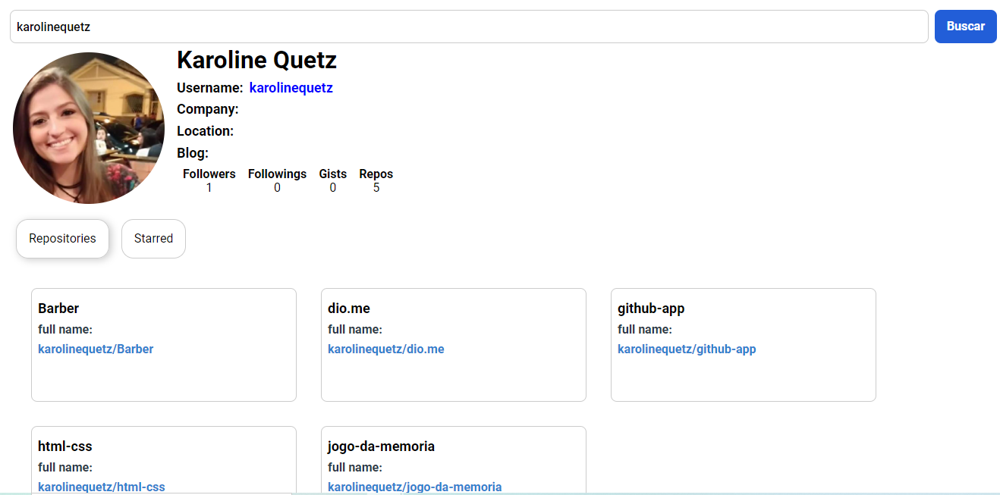

# github-app - Projeto para consultar api do github utilizando React JS

Este projeto foi desenvolvido durante o bootcamp dio.me. https://www.dio.me/

## Índice

- [Visão geral](#visão-geral)
  - [O projeto](#o-projeto)
  - [Screenshot](#screenshot)
- [Processo de desenvolvimento](#desenvolvimento-processo)
  - [Construído com](#construído-com)
- [Codificado por](#coded-by)

## Visão geral

### O projeto

- Consultar repositórios do Github

### Captura de tela

## Processo de desenvolvimento

### Construído com

- React JS
- Styled-components

## Codificado por

- LinkedIn - [@karolinequetz](https://www.linkedin.com/in/karolinequetz)
